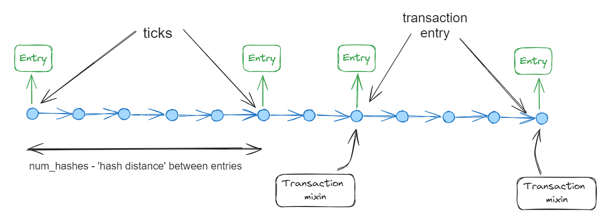
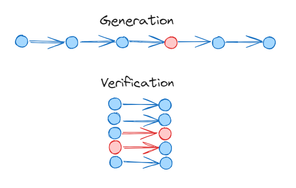
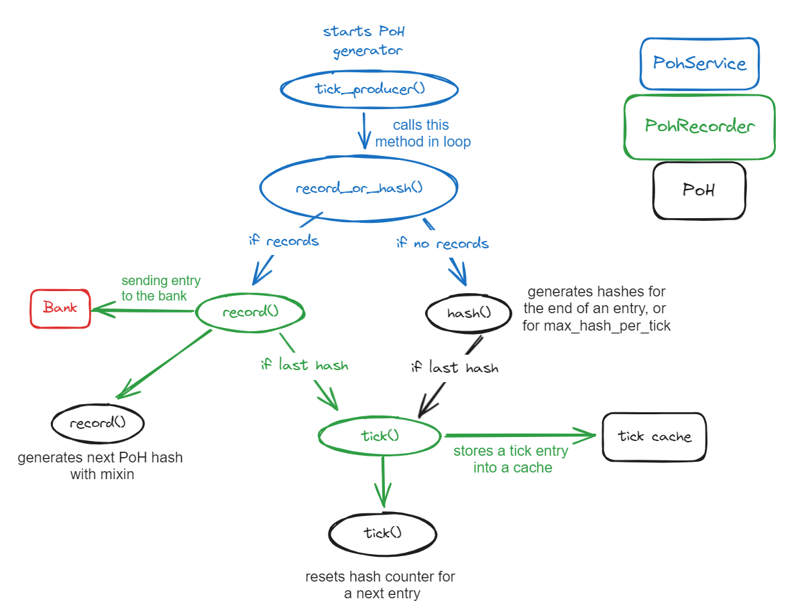

## What is Proof-of-History and how it works

PoH is essentially a continuous chain of cryptographic hashes. Hash in this chain serves as a timestamp, marking a specific moment in time. The process begins with an initial hash, and each subsequent hash is generated by hashing the previous hash. This creates a linked chain where each hash is dependent on the previous one.

Given the rapid rate at which new hashes are generated, it is impractical to store every single hash. Instead, PoH separates the hash chain into entries. Each entry contains the hash at the end of a sequence and the number of hashes generated between entries. This approach efficiently compresses the data while maintaining the integrity of the timeline.


### Entries and Ticks
An entry in PoH can either include transaction data or serve purely as a time marker. Entries that do not include transaction mixins and act solely as time points are called ticks.

In the current implementation by Solana Labs, approximately 12,500 hashes are generated between ticks. 

### Security and Verification
Changing the hash of one entry would necessitate changing all subsequent entries, as each hash is dependent on the previous one. This characteristic makes PoH extremely resistant to tampering.

The PoH chain can only be created sequentially, but it can be verified concurrently. This means that while generating a new valid chain requires following the sequence strictly, verifying the chain can be done in parallel, significantly speeding up the process:



The combination of sequential hash generation and parallel verification not only ensures the integrity of the blockchain but also enables it to scale efficiently. 

## PoH Implementation



The scheme of the PoH generator

## PoH module
The PoH module serves to track the state of PoH and adds the necessary functionality to modify that state.
	
`solana_entry::poh::Poh` is a struct that stores a current PoH chain hash, the number of hashes generated from the last entry, hash size of a tick, how much hash should be generated to get to the next entry, and some other variables.
```rust
pub struct Poh {
    pub hash: Hash,
    num_hashes: u64,
    hashes_per_tick: u64,
    remaining_hashes: u64,
    tick_number: u64,
}
```

`Poh::new()` initializes the PoH process with a given initial hash, the number of hashes between ticks, and a tick number to start with.

`solana_entry::poh::PohEntry` struct represents a single PoH entry. It only stores the ‘hash distance’ between the current and previous entry and the resulting hash value of the current entry.

```rust
pub struct PohEntry {
    pub num_hashes: u64,
    pub hash: Hash,
}
```

### Poh::hash() 

The `hash()` method performs sequential hashing, continuing the chain of hashes up to a specified maximum number of hashes (`max_num_hashes`) or until the remaining hashes required to complete a tick are exhausted. It updates the internal hash state and tracks the number of hashes performed. The method returns `True` if the next hash will complete a tick, signaling that it's time to switch to the next tick.


### Poh::tick()

This method generates a new tick by performing a hash and updating the internal state. When the remaining hashes reach zero, it resets the counter and increments the tick number, creating a new `PohEntry`.


### PoH::record()

`record()` method allows adding a mixin (additional data, in our case hash of transactions) to the PoH chain. This is useful for incorporating transactions into the PoH stream. If there's only one hash remaining before the next tick, it skips recording to ensure the tick is accurately represented. Otherwise, it creates a new `PohEntry` with the current hash state.


## PohRecorder

As mentioned previously, `solana_entry::poh::Poh` stores the state of PoH and adds functionality to change that state, while `solana_poh::poh_recorder::PohRecorder` mainly serves to interact with the Poh state and records transaction entries into a bank.
It ensures that each transaction and tick is accurately documented, providing a reliable history of events.

### Data structures used by PohRecorder

`solana_entry::entry::Entry` struct used by PohRecorder equivalent to `solana_entry::poh::PohEntry` but has an additional field to store transactions. Those entries are sent to the bank.
```rust
pub struct Entry {
    /// The number of hashes since the previous Entry ID.
    pub num_hashes: u64,
    /// The SHA-256 hash `num_hashes` after the previous Entry ID.
    pub hash: Hash,
    pub transactions: Vec<VersionedTransaction>,
}
```

`WorkingBank` struct holds a thread-safe reference to the Bank and to the starting instance of PoH recording, `max_height` and `min_tick_height` attributes to track if the Bank is recording entries in a specific timeframe, and `transaction_index` to store the index of the last processed transaction.
```rust
pub struct WorkingBank {
    pub bank: Arc<Bank>,
    pub start: Arc<Instant>,
    pub min_tick_height: u64,
    pub max_tick_height: u64,
    pub transaction_index: Option<usize>,
}
```

`WorkingBank` struct is essential for managing the state and progress of a bank within the PohRecorder. PohRecorder is responsible for recording transactions in real-time as they happen into the bank and sending them to the ledger’s entry channel. Each bank's operations are accurately recorded and timestamped within the recorder.

`Record` struct represents a record containing a mixin (transaction hashes), a list of transactions, a slot number, and a sender to send record results.
```rust
pub struct Record {
    pub mixin: Hash,
    pub transactions: Vec<VersionedTransaction>,
    pub slot: Slot,
    …
}
```

### PohRecorder::new()

`PohRecorder::new()` creates a PoH instance and sets up the bank, entry sender,  tick height, and tick cache.

### PohRecorder::record()

The method attempts to record transaction entries into the PoH stream:
```rust
let record_mixin_res = poh.record(mixin)
```

If successful, it creates an `Entry` and sends it to the bank:

```rust
if let Some(poh_entry) = record_mixin_res {
    let send_entry_res =
        {
            let entry = Entry {
                num_hashes: poh_entry.num_hashes,
                hash: poh_entry.hash,
                transactions,
            };
            let bank_clone = self.working_bank.bank.clone();
            self.sender.send((bank_clone, (entry, self.tick_height)))
        }
}
```

If the last hash is reserved for a tick, it triggers `PohRecorder::tick()`, and tries to re-record:

```rust
loop {

    // recording logic

    self.tick();
}
```

### PohRecorder::tick()

The method generates a new tick by invoking the `PoH::tick()`:

```rust
pub fn tick(&mut self) {
    let (poh_entry, target_time) =
        {
            let mut poh_l = self.poh.lock().unwrap();
		    
            // ticks
            let poh_entry = poh_l.tick();

            (poh_entry, target_time)
        }
```

It updates the tick height, then creates an `Entry` for the tick and adds it to the tick cache:

```rust
if let Some(poh_entry) = poh_entry {
    self.tick_height += 1;

    self.tick_cache.push((
        Entry {
            num_hashes: poh_entry.num_hashes,
            hash: poh_entry.hash,
            transactions: vec![],
        },
        self.tick_height,
    ));
}
```

In addition to these methods, there are also getter methods, methods to interact with a bank, make slot-related calculations, resetting, reporting, etc. 


## PohService

`solana_poh::poh_service::PohService` is an entry point to start a PoH generation. 
It tries to retrieve new transactions if present, and based on this uses PohRecorder to record them or create a new tick. 

### PohService::tick_producer()

Starts a loop that continuously processes records and generates entries.
```rust
fn tick_producer(...) {
        loop {
            let should_tick = Self::record_or_hash(...);
            if should_tick {
                poh_recorder.tick();
            }
        }
    }
```

#### PohService::record_or_hash()
The method checks if a new record is available. If yes, it is recorded using `PohRecorder::record()`:
```rust
Some(mut record) => {
    let res = poh_recorder.record(
        record.slot,
        record.mixin,
        record.transactions,
    );
}
```

If no record is available, the method checks if a tick should be generated and signals that, otherwise it will look for a new record:

```rust
None => {
    let should_tick = poh.hash(hashes_per_batch);
    if should_tick {
        // nothing else can be done. tick required.
        return true;
    }
    if let Ok(record) = record_receiver.try_recv() {
        *next_record = Some(record);
        return false;
    }
}   
```


Also, you can set Low-power mode for PoH to run in PohService settings.


## Summary
This blog post explains what is PoH and dives into Solana Labs implementation of PoH. The work of other crucial components (Bank, Leader Schedule, Slots, etc) are not explained to keep the blog simple, otherwise it becomes too complex to explain anything.
Also, I gave a simplified code, ignoring some other logic (such as metric collection), but it doesn't affect 
the core logic behind PoH